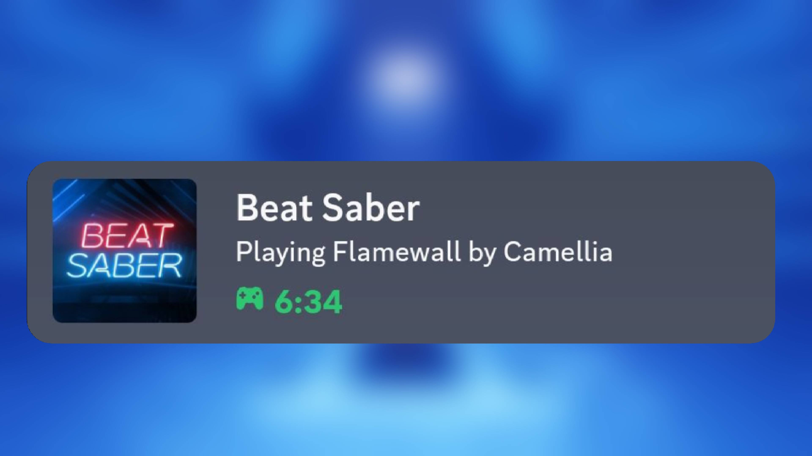

# DiscordRichPresence

A Beat Saber Quest mod for displaying status on Discord



## 📋 Requirements

- ✅ Modded Beat Saber Quest (MBF / QuestPatcher)
- ✅ Local server handling Discord Rich Presence updates
- ✅ Same network connection (Quest ↔ PC)

---

## 🚀 Quick Start

### 1. Install the Mod

Download and install the mod using your preferred Quest mod manager:

- Install via [MBF](https://mbf.bsquest.xyz/)
- Install via [QuestPatcher GUI](https://github.com/Lauriethefish/QuestPatcher)

### 2. Install Local Server

- For Linux: [Download Here](https://github.com/RainzDev/BeatSaberBridgeAPI/releases/download/v1.1.2/bridgeapi-linux)
- For Windows: [Download Here](https://github.com/RainzDev/BeatSaberBridgeAPI/releases/download/v1.1.2/bridgeapi-windows.exe)
- For MacOS: [Download Here](https://github.com/RainzDev/BeatSaberBridgeAPI/releases/download/v1.1.2/bridgeapi-macos)

### 3. Start the Server

Note: Please make sure your Discord app is opened.

<details>
<summary><b>🪟 Windows (CMD)</b></summary>

You can simply just double click the exe file to open it. (Please note that Windows Defender might flag it. This is due to the file not having a certificate.)
</details>

<details>
<summary><b>🍎 macOS (Terminal)</b></summary>

```bash
chmod +x bridgeapi-macos
./bridgeapi-macos
```
</details>

<details>
<summary><b>🐧 Linux</b></summary>

```bash
chmod +x bridgeapi-linux
./bridgeapi-linux
```
</details>

### 4. Configure the Mod

1. Open Beat Saber on your Quest
2. Go to `Settings → Mod Settings → DRP`
3. Enter your PC's [private IP](https://github.com/RainzDev/BSQ_DiscordRichPresence?tab=readme-ov-file#finding-your-private-ip) and port (Leave port as it is unless you know what you're doing)
4. Press "Ok"

Please note that if the Quest doesn't manage to connect to your server, look over these:

- Both Quest and PC should not be connected to a VPN
- Both must be using the same network
- Firewall must not be blocking

### 5. Verify Connection

Check your server console and you should see events showing up while you're doing something on Beat Saber.

## Finding Your Private IP

<details>
<summary><b>🪟 Windows (CMD)</b></summary>

```bash
ipconfig
```

**Look for:**
```
IPv4 Address . . . . . . . . . . : 192.168.x.x
```
</details>

<details>
<summary><b>🍎 macOS (Terminal)</b></summary>

```bash
ifconfig
```

**Look for:**
```
inet 192.168.x.x (under active interface, usually en0)
```
</details>

<details>
<summary><b>🐧 Linux</b></summary>

```bash
ip a
```

**Look for:**
```
inet 192.168.x.x/24
```
</details>

## Building

For a full introduction to Quest modding, visit the [BSMG Wiki](https://bsmg.wiki/modding/quest/intro.html).

To just build, install [QPM](https://github.com/QuestPackageManager/QPM.CLI/releases/latest), [CMake](https://cmake.org/download/), [Ninja](https://github.com/ninja-build/ninja/releases/latest), the [Android NDK](https://developer.android.com/ndk/downloads), and [Python 3](https://www.python.org/downloads/), then run:

```sh
qpm ndk resolve
qpm restore
qpm qmod zip
```

## Credits

* [Metalit](https://github.com/Metalit), [Lauriethefish](https://github.com/Lauriethefish), [Fern](https://github.com/Fernthedev), [Bobby Shmurner](https://github.com/BobbyShmurner) for: [this template](https://github.com/Lauriethefish/quest-mod-template)
* [Metalit](https://github.com/Metalit), [Sc2ad](https://github.com/Sc2ad), [zoller27osu](https://github.com/zoller27osu), [jakibaki](https://github.com/jakibaki) for: [beatsaber-hook](https://github.com/QuestPackageManager/beatsaber-hook)
* [Fern](https://github.com/Fernthedev) for: [QPM](https://github.com/QuestPackageManager/QPM.CLI), [bs-cordl](https://github.com/QuestPackageManager/bs-cordl), [paperlog](https://github.com/Fernthedev/paperlog)
