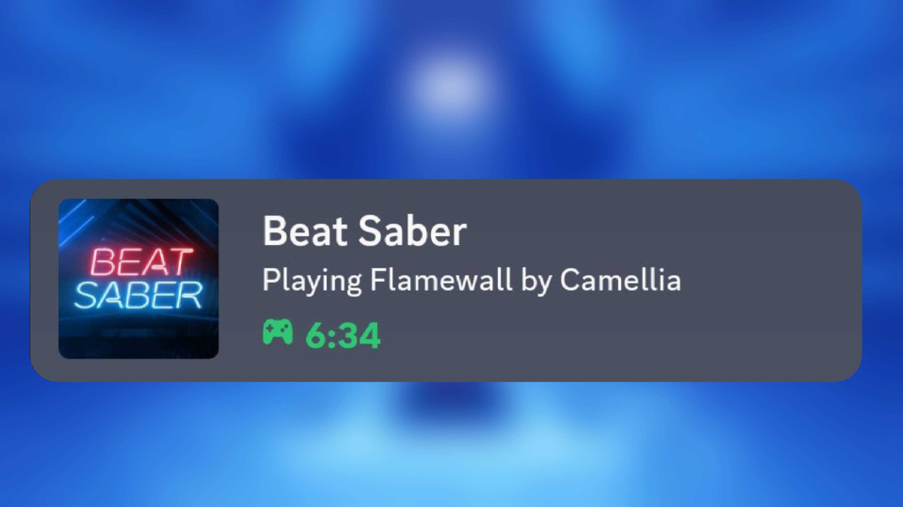

# DiscordRichPresence

A Beat Saber Quest mod for displaying status on Discord



## Presence Modes

The in-game `Discord Rich Presence` settings menu can route the same Beat Saber events in either of two ways:

- **Desktop Companion** keeps the original IP/port workflow and does not apply the Quest privacy settings.
- **Quest Discord App** binds directly to Discord's exported Android Social RPC service. It does not need a PC and exposes a 5/10/15-second gameplay update-speed selector plus per-field privacy switches for status, song metadata, gameplay stats, timer, artwork, platform badge, and multiplayer details.

Disabled Quest fields are omitted from the Discord activity rather than replaced with misleading zero or blank values.

> [!IMPORTANT]
> Quest Discord mode requires Beat Saber's manifest to contain a package-visibility query for `com.discord`. The QMOD declares this through the optional `mbfManifestRequirements` extension, which supported MBF builds apply automatically without another prompt. Older MBF releases and other installers may ignore the extension; if the Discord service is unavailable, the mod reports an actionable status in its settings. Desktop Companion mode does not need this manifest entry.

## 📋 Desktop Companion Requirements

- ✅ Modded Beat Saber Quest (MBF)
- ✅ Local server handling Discord Rich Presence updates
- ✅ Same network connection (Quest ↔ PC)

---

## 🚀 Quick Start

### 1. Install the Mod

Download and install the mod using your preferred Quest mod manager:

- Install via [MBF](https://mbf.bsquest.xyz/)

### 2. Install Local Server

- For Linux: [Download Here](https://github.com/RainzDev/BeatSaberBridgeAPI.CPP/releases/download/v0.2.0/BeatSaberBridgeAPI-linux.zip)
- For Windows: [Download Here](https://github.com/RainzDev/BeatSaberBridgeAPI.CPP/releases/download/v0.2.0/BeatSaberBridgeAPI-windows.zip)
- For MacOS: [Download Here](https://github.com/RainzDev/BeatSaberBridgeAPI.CPP/releases/download/v0.2.0/BeatSaberBridgeAPI-macos.zip)

### 3. Start the Server

> [!NOTE]
> This can be opened without needing your Discord client opened, as this is using Discord's Social SDK instead of Game SDK.

<details>
<summary><b>🪟 Windows</b></summary>

Extract the zip file and then open it. You can then simply just double click the exe file to open it. (Please note that Windows Defender might flag it. This is due to the file not having a certificate.)
</details>

<details>
<summary><b>🍎 macOS (Terminal)</b></summary>

Extract the zip folder, and then run these commands.

```bash
cd BeatSaberBridgeAPI-macos
chmod +x BeatSaberBridgeAPI
./BeatSaberBridgeAPI
```
</details>

<details>
<summary><b>🐧 Linux (Terminal)</b></summary>

Extract the zip folder, and then run these commands.

```bash
cd BeatSaberBridgeAPI-linux
chmod +x BeatSaberBridgeAPI
./BeatSaberBridgeAPI
```
</details>

### 4. Authorize to RPC

Once the server is running, you should see a pop-up on your Discord client asking you to authorize. Make sure to click "Authorize".

If your Discord client is closed or not installed, it'll instead open up a page in your default browser.

> [!NOTE]
> This will only be shown once. Running the executable again will not show the authorization and will automatically connect you. If you want to use a different account, manually deauthorize by going to your Discord User Settings, press "Connected Apps" and click "Authorized Apps" in the dropdown, and then press "Deauthorize" for Beat Saber.

### 5. Configure the Mod

1. Open Beat Saber on your Quest
2. Open `Mods → Discord Presence`, or go to `Settings → Mod Settings → Discord Rich Presence`.
3. Enter your PC's [private IP](https://github.com/RainzDev/BSQ_DiscordRichPresence?tab=readme-ov-file#finding-your-private-ip) and port. (The port must be set as `8080` unless you know what you're doing)
4. Press "Ok"

> [!NOTE]
> If the Quest doesn't manage to connect to your server, look over these:
>
> - Both Quest and PC should not be connected to a VPN
> - Both must be using the same network
> - Firewall must not be blocking

### 6. Verify Connection

Check your server console and you should see events showing up while you're doing something on Beat Saber.

## Finding Your Private IP

<details>
<summary><b>🪟 Windows (CMD)</b></summary>

```bash
ipconfig
```

**Look for:**
```
IPv4 Address . . . . . . . . . . : 192.168.x.x
```
</details>

<details>
<summary><b>🍎 macOS (Terminal)</b></summary>

```bash
ifconfig
```

**Look for:**
```
inet 192.168.x.x (under active interface, usually en0)
```
</details>

<details>
<summary><b>🐧 Linux</b></summary>

```bash
ip a
```

**Look for:**
```
inet 192.168.x.x/24
```
</details>

## Todo

- [x] Fix level selection not detecting when pressing "continue" from result view
- [x] Fix heartbeats not being sent when in a beatmap
- [x] Fix result view being automatically switched to level selection
- [x] Fix beatmap not showing the stats if restarted

## Building

For a full introduction to Quest modding, visit the [BSMG Wiki](https://bsmg.wiki/modding/quest/intro.html).

To build, install [QPM](https://github.com/QuestPackageManager/QPM.CLI/releases/latest), [CMake](https://cmake.org/download/), [Ninja](https://github.com/ninja-build/ninja/releases/latest), the [Android NDK](https://developer.android.com/ndk/downloads), Python 3, JDK 21, and Android SDK build tools 36. The helper script reads `JAVA_HOME`/PATH and `ANDROID_HOME` or `ANDROID_SDK_ROOT`; its original Visual Studio Android locations remain Windows fallbacks.

```sh
pwsh ./scripts/build-discord-rpc-helper.ps1
qpm ndk resolve
qpm restore
qpm qmod zip
python scripts/inject_mbf_manifest_requirements.py DiscordRichPresence.qmod
```

The final step is required because QPM.CLI currently drops unknown root fields while generating
`mod.json`. The script validates the MBF extension, rewrites the archive atomically, and verifies
that every non-manifest payload remains byte-for-byte unchanged.

## Credits

* [Metalit](https://github.com/Metalit), [Lauriethefish](https://github.com/Lauriethefish), [Fern](https://github.com/Fernthedev), [Bobby Shmurner](https://github.com/BobbyShmurner) for: [this template](https://github.com/Lauriethefish/quest-mod-template)
* [Metalit](https://github.com/Metalit), [Sc2ad](https://github.com/Sc2ad), [zoller27osu](https://github.com/zoller27osu), [jakibaki](https://github.com/jakibaki) for: [beatsaber-hook](https://github.com/QuestPackageManager/beatsaber-hook)
* [Fern](https://github.com/Fernthedev) for: [QPM](https://github.com/QuestPackageManager/QPM.CLI), [bs-cordl](https://github.com/QuestPackageManager/bs-cordl), [paperlog](https://github.com/Fernthedev/paperlog)
